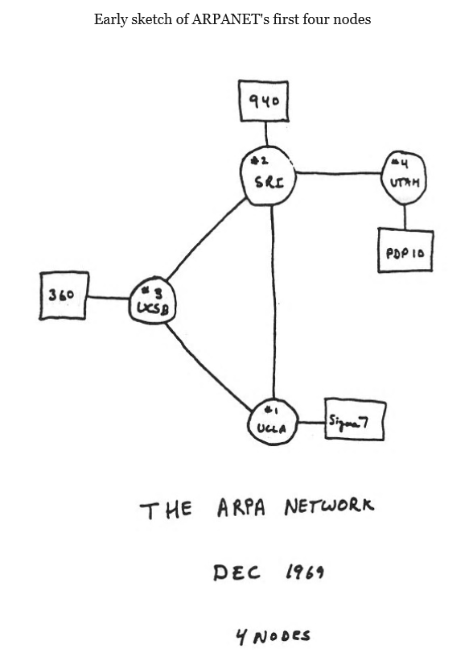

# Module 1: Intro to Computational Thinking

This course aims to teach you computational thinking. Along the way, you will also learn to programming. But the main objective is to not make you computer scientists, rather make you a computational X, where X can be anything. While one of the objectives of this course is to introduce you to programming, for the first module, we are not going to be programming (in the traditional sense). Instead, we will train ourselves to think in a "computational" or programmatic style, which will make programming much easier when we get to it. We will also introduce key concepts and terminology that we will be using throughout the semester. Key concepts that we will get an intuition for (not study formally, yet)

1. What is a computer? How does it work? Is it Intelligent? (Hint: It not!)

2. Programming as giving instructions to an assistant. How to be precise.

3. What problems can a computer help us solve? Which problems is it better than us at solving? What kind of problems can a computer not solve?

4. Broad outline of using a computer to help solving problems.

## Why Computing?

You might have a decent idea of why you wish to study computing, given you are registered for this course. But, more fundamentally, you might not be completely clear on-- What is computer science?, What do computer scientists and computer application developers do? And what tools do they use? This module will aim to answer some of those questions, allowing you to get a better sense of exactly how much (and which aspects of) computer science (CS) you need to master. 

Computers are ubiquitous now and most of us carry a very powerful computer with us all the time. They are also cheap enough that we can use them for numerous tasks without worrying about the cost of 'computerizing' a task. Computers cannot do everything, but if used properly can help us do certain tasks **faster**, **more accurately** and **more reliably** and allow us to **solve large problems** that might not have been feasible by humans (alone). Understanding which problems computers can help us solve can help us do our jobs better and more efficiently. The objective of this course is to introduce you to computing and teach you to look at the world from a computer science perspective.

Broadly there are two sets of tools for a computer scientist; Computer systems being the first. We use computer systems to refer to the hardware, the **operating system**, the **network and the internet**,  and the **programming language** used to write programs. We will get a very quick introduction to computer systems and its various components in the next section. 

The second set of tools is **computational thinking**, the skills including logic and reasoning needed to develop computer applications. We will introduce computational thinking in this module and refine and develop it throughout the semester in the process of developing different applications. 

### Data & Algorithms

Data [Structures] and Algorithms are fundamental concepts that we will repeatedly encounter during this course, and while your understanding of these terms will continue to refine during the progress of the course, let us start with a very basic understanding. In order to solve real-world problems, we need a *model* that represents the setup within which the problems is to be solved. The *model* is an abstract representation of the environment and in most cases is an approximation or simplification. The model can represent streets in 'Google maps', stock market indices, patient information for example. The *data* would be the actual information stored on the computer system, typically in a specific format called as the **data structure**. Note that while both sound similar, the *model* is a more abstract decision on how the real-world is approximated on a computer, while the data is what is actually stored. For example, in our Google maps example, the model decides that we only need to store streets and not sidewalks or where trees are planted. 

As computer scientists, we develop *algorithms* that operate within the *model* and create, modify or transform the *data*. The algorithm is a sequence of instructions, or a recipe to perform a specific task. Imagine, passing instructions to a secretary (who is not very good), asking them to perform a task. Each instruction modifies information is a specific, well-defined way to achieve the desired goal. While there is a lot of talk about machine learning and artificial intelligence, while starting to program, it is important that you assume *zero intelligence* from the computer.  Think of the most error-prone assistant to whom you need to pass instructions. Be as specific and unambiguous as possible to ensure that the assistant is able to complete the task successfully. Also (for now) assume that the assistant will not be able to seek clarifications, so if the instructions are not clear, then the task will fail. 

The final step is to implement the *algorithm*, i.e., the instructions in a language that the computer can understand. Human languages, like English or Spanish are easy for humans to communicate, but are still quite hard for machines to master (think Siri or Google Assistant). Therefore, we pass these instructions in a computer language like Python (there is more to this, but we will get to it later). What is important for you to realize at this point is that the information is mostly uni-directional, i.e., from you to the computer. In other words, computer languages are designed to be easy for you to write (for humans to speak) and for the computer to follow (for machines to understand). This means that computer languages are hard(er) for humans to understand. Therefore, in the beginning do not be discouraged if you look at programming (code) examples and find it difficult to follow. There are several tools that are available for us to write (and read) code, such as syntax checkers (similar to spelling and grammar checkers in Word for example) that will simplify the process.

We will now briefly understand what a computer is and how it works. After all, the computer is the assistant that will carry out our instructions, so its important we understand what it is capable of. During the process, we will also try to get an intuitive sense of what kind of problems computers are best suited for.

## Computer Systems

A computer system is a combination of hardware and software components that work together to execute applications/programs/software. The hardware is made up of physical components, such as the processor, memory chips, keyboards, smartphone etc. The software is made of all the non-physical components of the system, including the operating system (windows, osx, android, ios), programming languages etc.

### Hardware

The computer hardware refers to the physical components of a computer system. For example, a desktop computer, a laptop or a smartphone can all be referred to as computer hardware. While there are differences in different hardware (laptop vs smartphone) at a fundamental level they are all similar, and it is important to understand this basic computer hardware or *computer architecture*.

The core component is the Central Processing Unit (**CPU**) or the processor, that does the actual computations. We also need some way to communicate with the computer and this happens via **input** devices, such as keyboards, touchscreens etc. Similarly, we need **output** devices that are used by the computer to communicate with us, such as monitors, printers, speakers etc. 

Now there are two forms of data storage on modern computers (actually more, but this level of detail is sufficient for our purposes), hard disk and RAM (random access memory). Recall that I mentioned that computers are not very intelligent, and therefore think of an assistant who does not remember anything (the CPU). The memory/RAM is a non-permanent storage device used during computations. Think of something like a scrap piece of paper that you might use for computing the tip in a restaurant. This is used only during computations and not for long term storage, If you reboot your machine, this information is lost. The size or capacity of the memory dictates how large a problem you can solve, or the amount of data you can work on at a given time. For example, you can use the back of the receipt for calculating the tip, but it might be hard to do your taxes on it. You will need a larger piece of paper(s) to do your taxes. Once you have done your taxes, you will not want to loose it, so we can store it to the hard-disk drive (HDD). This is permanent (almost) and will not be lost when the machine reboots for example. The size of the storage will dictate how large a dataset I can store and compute on, but not in the same way as RAM. Assume you have an erasable whiteboard of appropriate size to do taxes for one person (our RAM). I can still do taxes for hundreds of customers if I have enough storage on my HDD to save them. Once we have computed the taxes for one person, we will save the information to HDD and clear the whiteboard before working on the next case. 

Besides the issue of whether the problem can fit in the RAM, sometime we also need to consider how long the CPU could take to perform the computations. Modern computers are fast and can do billions of computations per second, but this is only true for simple, structured instructions (like doing taxes). Again, going back to our not-so-intelligent assistant, assume this assistant was very fast at following instructions, think of all the tasks that could be performed well by this assistant. Could this assistant arrange all the books in the library alphabetically ? Probably within a second. Could this assistant write a summary for a book? This would be a much harder task. To understand why, try to think how you would provide instructions to our not-so-smart assistant to summarize a book. As a simple metric for assessing whether the task is appropriate for a computer, a computer is going to be efficient for simple, repetitive or large tasks. A human is likely to occasionally make errors with repetitive tasks. A human is likely very slow (compared to a computer) for large tasks. But for complex tasks, that require complex analysis and training, a human is likely better. (Advances in Computer Science are reducing the number of tasks that computers are not capable of doing, but within the scope of this course, we will focus on simple tasks.)

Finally, it is important to realize that there are problems that are not solvable by computers (the kind that are readily available currently). For example, assume you wanted a computer to hack into an account by trying all combinations of passwords, after all it can try billions in a second. It turns out it would need to try trillions and trillions, and would take thousands of years. Modern computer security and cryptography (including currencies like bitcoin) depend of the inability of computers to perform certain computations efficiently. This is one of the reasons web-services ask you to have long passwords and include numbers and special characters. Determining which problems are hard for a computer to solve is part of advanced CS. For now, all I want you to realize is that some problems are extremely difficult for a computer to solve in reasonable time.   

### Operating Systems

Most developers do not work with computer hardware directly, as it would be extremely difficult it the developer had to write instructions for different hardware components. It could also be very dangerous (and insecure) as a programming mistake (bug) could incapacitate the hardware. Instead, the programmers requests the *Operating System* (OS) to interact with different hardware components on behalf of the application. This also simplifies and standardizes the overall process of interacting with different hardware components like keyboards, hard-drives, the network etc. The two main reasons for the existence of OS is,

1. to protect the hardware from misuse by applications

2. to facilitate easy and standardized access to hardware for different applications. 

Common OS are Windows, OS X (on Macs), Linux, IOS and Android. 

### Networks and Internet

Many of the applications we use on a daily basis require the computer to be connected to the Internet. Without an internet connection, we cannot send an email, browse the web, watch videos online or attend classes in the age of COVID-19. In order to be connected to the internet, you must connect to a *computer network* that is part of the internet. A computer network is a system of computers that can communicate with each other. There are different ways of doing this including, wireless (e.g., WIFI, cellular) and others that use cables like Ethernet. In most cases, we will access the network (including the internet) via the OS and not directly.     

**Fun Fact:** The University of Utah was one of the first [4 nodes of the Arpanet](http://www.usna1959.com/m59/classWeb1stFour.php), the precursor to the modern Internet. 

### Programming Languages

What separates computers from other machines (refrigerator, car, etc.) is that computers can be programmed. This means that the computer can do several jobs based on the programming. You have a very good example of this in your smartphone, that can be a camera, music player, calculator and a lot more depending on the application you choose to run. Because computers cannot process ambiguity the way we (humans) can, the instructions must be precise. Computers do exactly what they are told and cannot understand what the programmer *intended* to write. The computer is not capable of asking for a clarification (unless it has been programmed to do so), and will likely result in an error if given ambiguous commands. As humans, and with human languages, we communicate in a surprisingly imprecise manner, with a lot of ambiguity, requiring a lot of context. Human communication also includes misleading aspects such as sarcasm, which are difficult for computers to understand. For most of us, communicating in a precise, unambiguous fashion is the first step towards writing good computer programs. It can be a good exercise to write clear instructions for common tasks to practice computational thinking. A side effect is that this will also force you to evaluate which tasks are likely done more efficiently by a computer. 

The instructions that are executed by computers are in machine language, represented in binary notations (sequence of 0s and 1s). Because machine language (also called assembly language) are hard to work with, computer scientists have developed programming languages and language translators that enable developers to write instructions in a human readable language and translate them into machine language. Such translators are referred to  as *assemblers*, *compilers* or *interpreters*, depending on the programming language. There are also additional tools available to simplify the task of writing code and running programs from specialized editors to debuggers.  

### Software Libraries

Writing correct and good code, is time consuming, and we do not want to do program the same task repeatedly. For example, with our assistant, we will not provide them with fresh instructions everyday on how to make coffee. Unless something has changed, we will simply ask them to make us coffee. Similarly, while writing code, common instructions can be packaged into *software libraries*, both for code written by us, but more commonly for code that is meant to be shared. As non-CS students, we will make heavy use of software libraries for complex tasks for which someone else has written the code. Just like how we are able to use a car without knowing how to build one, in many cases we can use the software libraries without having to write all the code from scratch.  
